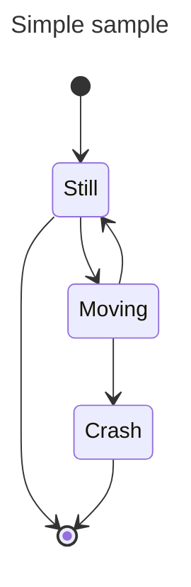

# Introducciómn

## Apartado 1

Esta es una       linea
Otro texto

Esta es otra linea, si doy dosveces al enter me deja un espacio entre medias

espacio

Una linea  
hola  
si doy espacio dos veces y enter me hace salto de linea sin espacio


### Otro apartado

Es un apartado

### Es igual


## Apartado 2
* Elemento 1
* Elemento 2
    * Más elementos
    * tabulo

## Lista ordenada

1. lista ordenada
2. mas cosas

# Texto

Esta palabra está en **negrita**

Esta está en *cursiva*

# python


```python
# -- Ejemplo de código en python
a = 2
print("Programa en python")
print(f"La variable a vale {a}")
```

# Enlaces 

## Enlaces externos

En wikipedia encontramos más información sobre [markdown](https://es.wikipedia.org/wiki/Markdown)

## Enlaces internos

Aquí hay información sobre [los enlaces](#Enlaces) en markdwon


# Imágenes

## Imagen en fichero local


## Imagen en URL


# Citas

Un par de citas de Isaac Asimov:

> Escribo por la misma razón por la que respiro, porque si no lo hiciera, moriría

> Estoy convencido de que la autoeducación es el único tipo de educación que existe

# tablas


|         | Col 1 | Col 2| Col 3| Col4 |
|---------|-------|------|------|------|
|  Fila 1 |   1   |   2  |   3  |  4   |
|  Fila 2 |   2   |   4  |   6  |  8   |
|  Fila 3 |   3   |   6  |   9  |  12  |


|          |  node.js  | Django | Flask | Electron |
|----------|-----------|--------|-------|----------|
| Lenguaje | Js        | Python | Python| js       |
| URL      | [link](https://nodejs.org/es/) | [link](https://www.djangoproject.com/)  | [Link](https://flask.palletsprojects.com/en/1.1.x/) | [Link](https://www.electronjs.org/) |
| Versión  |  14.15.5  | 3.1.6  | 1.1.2 | 11.2.3 |

# fórmulas matemáticas

Teorema de pitágoras: $h^2 = x^2 + y^2$

$\alpha=\beta + \gamma$

$`T = \{\phi, \psi, \chi, \neg, \rightarrow, \left(, \right) \}`$   

Tenemos las variables $a_1$ y $a_2$

$F = G \left( \frac{m_1 m_2}{r^2} \right)$  

...Donde $n \in \mathbb{N}$ con $n \leq 6$

# notas

> **_NOTA:_**  Esta es una nota creada con markdown estándard

---
> **_NOTA:_**  
>  Esta es otra nota creada con markdown estándard

---

> [!NOTE]  
> Esta es una nota del Markdown de Github

> [!TIP]
> Se usa para dar información adicional (Trucos)

> [!IMPORTANT]  
> Información importante!

> [!WARNING]  
> Información crítica que requiere una atención especial del usuario

> [!CAUTION]
> Precaución! Este comando puede borrar tu disco duro!


# diagrama


---
title: Simple sample
---
stateDiagram-v2
    [*] --> Still
    Still --> [*]

    Still --> Moving
    Moving --> Still
    Moving --> Crash
    Crash --> [*]




# comentarios

<!-- Esto es un comentario -->

# desplegado de información

<details>
  <summary>Más información</summary>
  Esta información aparece al desplagarse....
</details>

